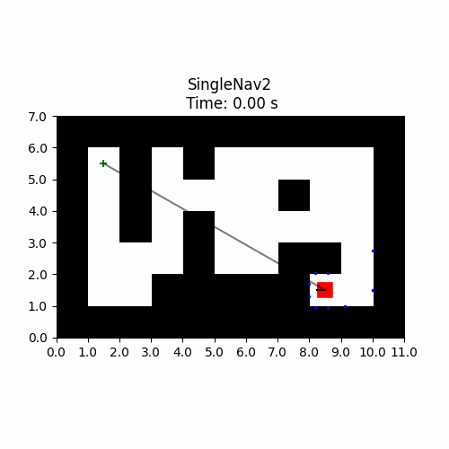
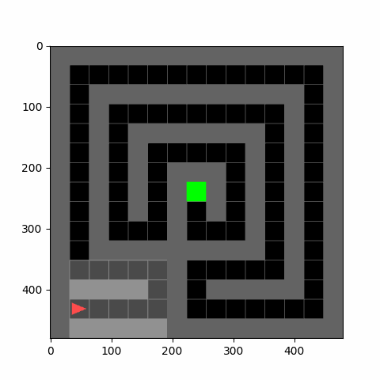
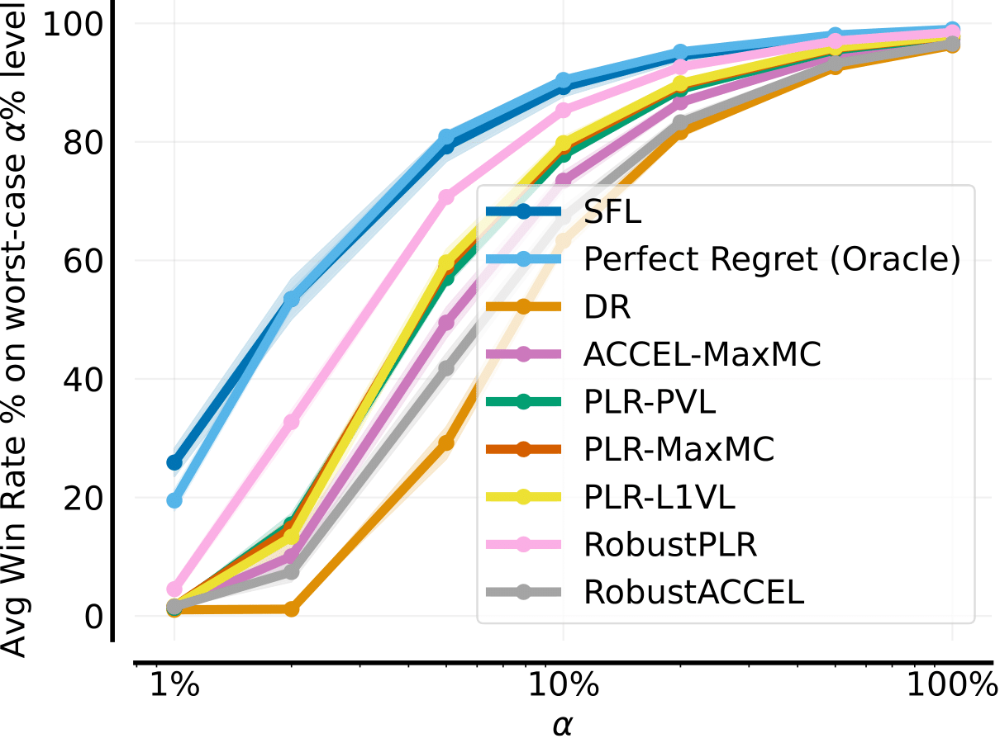
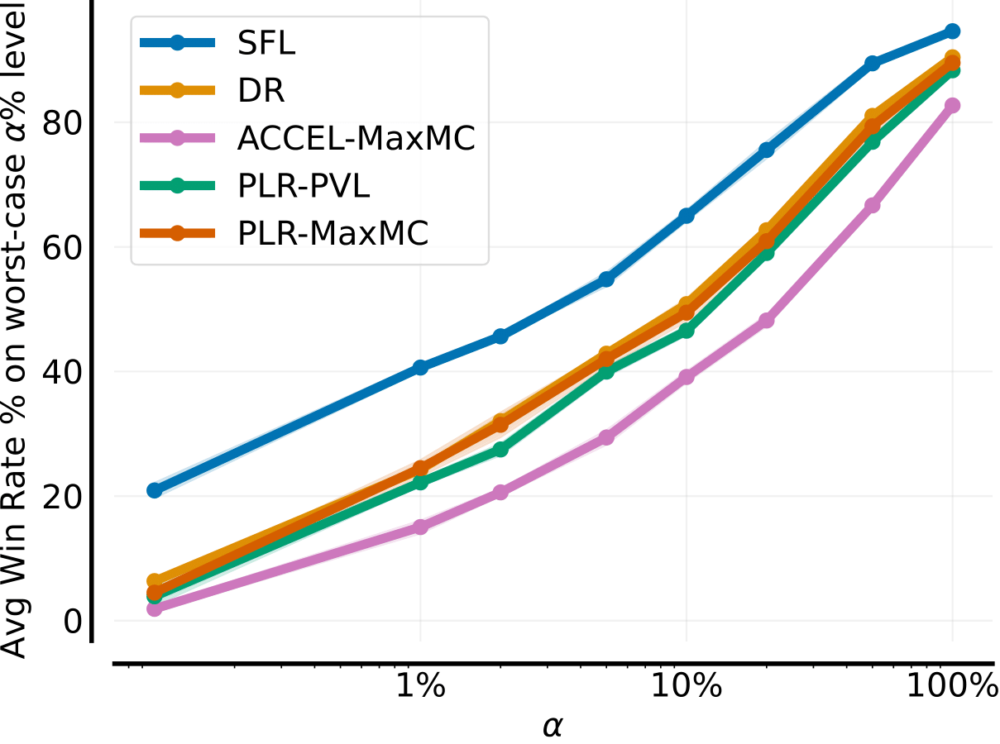
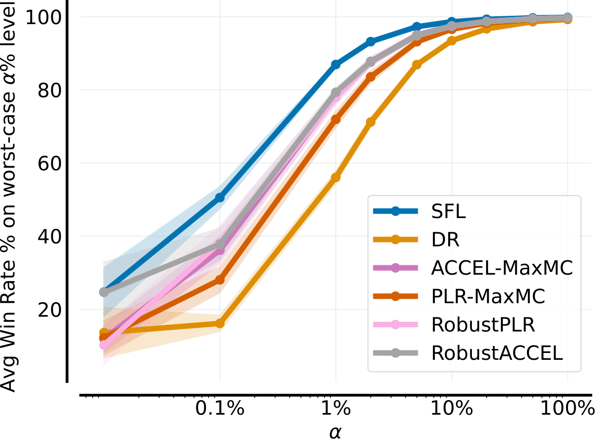
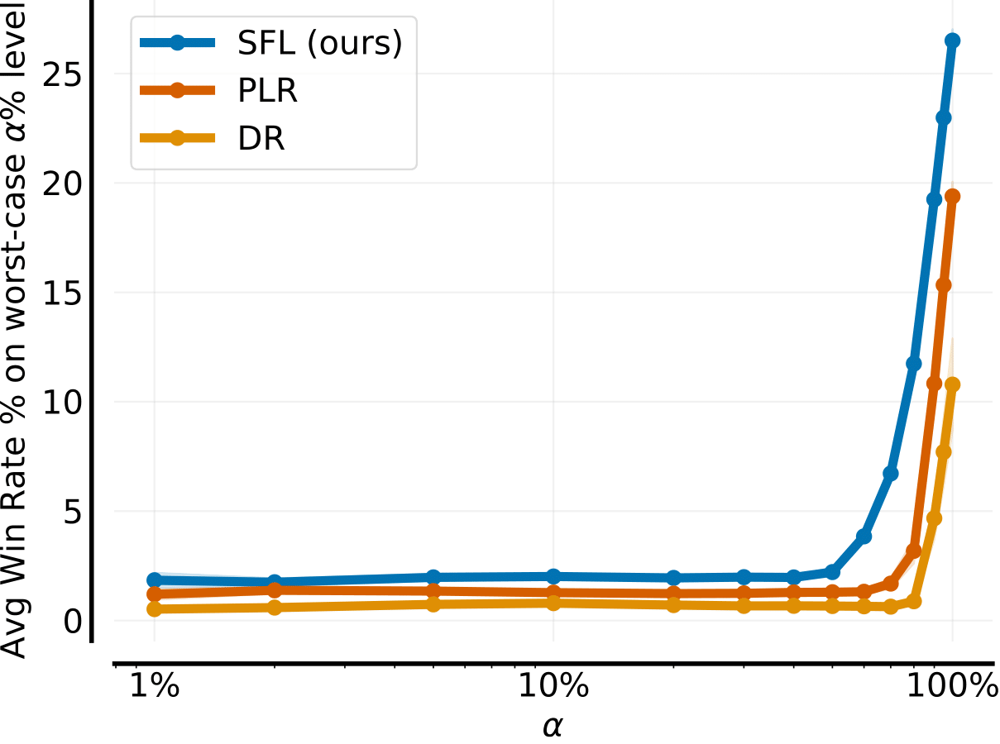

# No Regrets: Investigating and Improving Regret Approximations for Curriculum Discovery

<div class="collage">
    <div class="column" align="centre">
        <div class="row" align="centre">
            
            
            
            
        </div>
    </div>
</div>

---
<p align="center">
       <a href= "https://github.com/amacrutherford/sampling-for-learnability/blob/main/LICENSE">
        </a>
       <a href= "https://arxiv.org/abs/2408.15099">
        </a>
</p>

🎉 **Update: We were accepted at NeurIPS 2024, see you all in Vancouver!**

A repoistory for training **unsupervised environment design** (UED) methods on **2D navigation** tasks. We support three environments:
- **JaxNav**, our Jax-based simulator for single- and multi-robot 2D geometric navigation, this environment is imported from [JaxMARL](https://github.com/FLAIROx/JaxMARL).
- **MiniGrid**: a sigle-agent maze navigation domain, this environment is imported from [JaxUED](https://github.com/DramaCow/jaxued).
- **XLand-Minigrid**: a goal-oriented, grid-based, meta-RL task inspired by XLand and MiniGrid, imported from [XLand-MiniGrid](https://github.com/corl-team/xland-minigrid) and often refered to as just XLand in this repo.

We include several UED methods:
- **Sampling For Learnability (SFL)**, our proposed UED method for binary-outcome deterministic settings.
- **[PLR](https://arxiv.org/abs/2010.03934)**
- **[Robust PLR](https://arxiv.org/abs/2110.02439)**
- **[ACCEL](https://arxiv.org/abs/2203.01302)**
- **[Domain Randomisation](https://arxiv.org/abs/1703.06907)**

Our PLR and ACCEL implementations are built off [JaxUED](https://github.com/DramaCow/jaxued).

## Paper TL;DR

We introduce **Sampling For Learnability (SLF), a new UED method** for binary-outcome deterministic settings which outperforms current state-of-the-art approaches on Minigrid and our robotics simulator JaxNav. SFL uniformly randomly samples maps based on *learnability* which given an agent's success rate on a level $p$, is calculated as $p\cdot (1-p)$. By training on levels with learnability, SFL is able to find the frontier of the agent's ability and hence improve robustness.

Rather than just comparing performance on a set of hand designed test maps, we introduce **a new evaluation protocol for curriculum methods, designed to explicitly test robustness**. Our protocol computes a *risk* metric on the performance of the method, by evaluating its performance in the worst $\alpha\%$ of a newly sampled set of environments. Results for this protocol are illusrated below, with our SFL method proving more robust.

<table>
  <tr>
    <td align="center" width="25%">
      
      <p><b>JaxNav Single-Agent</b></p>
    </td>
    <td align="center" width="25%">
      
      <p><b>JaxNav Multi-Agent</b></p>
    </td>
    <td align="center" width="25%">
      
      <p><b>MiniGrid Maze</b></p>
    </td>
    <td align="center" width="25%">
      
      <p><b>XLand-MiniGrid</b></p>
    </td>
  </tr>
</table>

## ⬇️ Install

We reccomend using our Dockerfile. With Docker and the [Nvidia Container Toolkit](https://docs.nvidia.com/datacenter/cloud-native/container-toolkit/latest/index.html) installed, it can be built with `$ make build` and run with `$ make run`.

For installing from source, first ensure you have the correct [JAX version](https://github.com/google/jax#installation) for your system installed and then install our dependencies with `$ pip install -e .`

### ⚠️ XLand

XLand-Minigrid has a different JAX requirement to JaxMARL and JaxUED. As such, code for xland is held seperately within `xland/`, with seperate a Dockerfile and Makefile located within.

## 🎯 Reproducing results

### 🧗🏼‍♂️ Train policies
All training scripts can be found within `sfl/train` and we include a set of configuration files, contained within `sweep_configs`, to launch experiements across a number of seeds using `wandb` sweeps. We also include a helpful script for easily starting sweeps, `start_wandb_sweep.py`. Using this script, SFL on single-agent JaxNav can be run across 4 GPUs with 1 agent per gpu as:
```bash
$ python start_wandb_sweep.py sweep_configs/jaxnav-sa_sfl_10seeds.yaml 0:4 1
```
We use `wandb` for logging, your API key and entity can be set within the Dockerfile.

### 📊 Evaluate performance
You can either use your own trained policies (downloaded from `wandb`) or our saved checkpoints (located within `checkpoints/`). For all settings (JaxNav single agent, JaxNav multi agent, MiniGrid and XLand), evaluation is a three step process using scripts located within `sfl/deploy` for the first three and within `xland/eval` for XLand.

1. A set number of levels are generated using `*_0_generate_levels.py`. These levels are saved to `sfl/eval/ENV_NAME`, with `ENV_NAME` being either `jaxnav` or `minigrid`.
2. Rollouts for the methods under consideration on these levels are collected with `*_1_rollout.py`, **run this twice for two seeds** (we use 0 and 1). Results from these rollouts are saved as csv's to `sfl/data/eval/results`.
3. The performance of all methods is analysed by `*_2_analyse.py`, with results plotted and saved to `results/`.

If you instead wish to analyse and vizualise performance on the hand-designed test sets, you can use `sfl/deploy/deploy_on_singletons.py` for JaxNav and `sfl/deploy/deploy_minigrid_on_singeltons.py` for MiniGrid. For the sampled test sets used with JaxNav, use `sfl/deploy/deploy_on_sampled_set.py`.

To reproduce our graph illustrating how current UED scoring metrics do not correleate with learnability, but instead with success rate, use the `sfl/deploy/deploy_on_sampled_and_calc_regret.ipynb` notebook.

## 🧭 JaxNav

This Jax-based environment for 2D geometric navigation is introduced with this work but the code and documentation is held within [JaxMARL](https://github.com/FLAIROx/JaxMARL/tree/main/jaxmarl/environments/jaxnav).

## Citation

If you use our SFL method or JaxNav in your work, please cite us as:
```bibtex
@misc{rutherford2024noregrets,
      title={No Regrets: Investigating and Improving Regret Approximations for Curriculum Discovery}, 
      author={Alexander Rutherford and Michael Beukman and Timon Willi and Bruno Lacerda and Nick Hawes and Jakob Foerster},
      year={2024},
      eprint={2408.15099},
      archivePrefix={arXiv},
      primaryClass={cs.LG},
      url={https://arxiv.org/abs/2408.15099}, 
}
```

